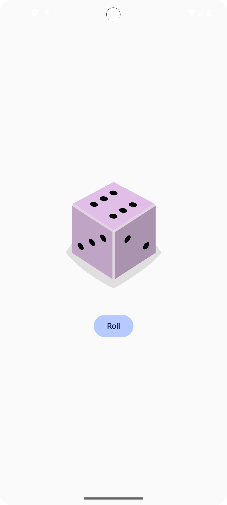

# 🎲 Dice Roller App

A fun and simple Android app that simulates rolling a dice using **Jetpack Compose**. Tap the "Roll" button to generate a random dice face (1–6) and see the result instantly with a smooth UI update.


---

## 🛠️ Technologies Used

- **Kotlin** – primary programming language
- **Jetpack Compose** – modern Android UI toolkit
- **Android Studio** – development environment
- **Compose State Management** – for handling UI state
- **Drawable Resources** – for dice face images
- **String Resources** – for localization-ready text

---

## 📱 How to Use

1. Launch the app on your Android device or emulator.
2. A dice image will be displayed in the center of the screen.
3. Tap the **"Roll"** button to simulate a dice roll.
4. The dice image updates to show a number between **1 and 6**.
5. Keep rolling for fun and randomness!

---

## 🔁 Cloning the Project

To get the app running on your local machine:

```bash
git clone https://github.com/Venumadhavmule/Dice-Roller.git
---
## How to Run
1. Open the cloned project in Android Studio.
2. Let Gradle finish syncing.
3. Connect an Android device or start an emulator.
4. Press the Run button ▶️ or use **Shift + F10**.
